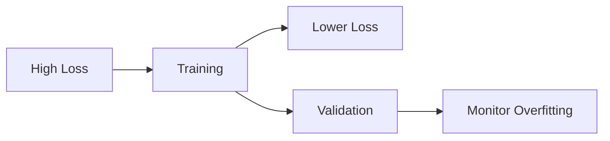

## Introduction
Neural networks form the backbone of modern deep learning. Let's explore their inner workings through mathematics, code, and intuitive explanations.

### Key Components
* **Neurons**: Basic computational units
* **Weights**: Learnable parameters
* **Activation Functions**: Non-linear transformations
* **Layers**: Organized groups of neurons

## Mathematical Foundation

The basic neuron computation can be expressed as:

$$
y = \sigma(\sum_{i=1}^{n} w_ix_i + b)
$$

Where:
* $\sigma$ is the activation function
* $w_i$ are the weights
* $x_i$ are the inputs
* $b$ is the bias term

### Activation Functions

Common activation functions include:

| Function | Formula | Use Case |
|----------|---------|----------|
| ReLU | $max(0, x)$ | Hidden layers |
| Sigmoid | $\frac{1}{1+e^{-x}}$ | Binary classification |
| Tanh | $\frac{e^x-e^{-x}}{e^x+e^{-x}}$ | Normalized inputs |

## Implementation Example

Here's a simple neural network implementation in PyTorch:

```python
import torch
import torch.nn as nn

class SimpleNN(nn.Module):
    def __init__(self, input_size, hidden_size, output_size):
        super(SimpleNN, self).__init__()
        self.layer1 = nn.Linear(input_size, hidden_size)
        self.relu = nn.ReLU()
        self.layer2 = nn.Linear(hidden_size, output_size)
    
    def forward(self, x):
        x = self.layer1(x)
        x = self.relu(x)
        x = self.layer2(x)
        return x

# Create model
model = SimpleNN(input_size=10, hidden_size=20, output_size=2)
```

## Training Process

1. **Forward Pass** 
   - Input propagates through network
   - Predictions generated

2. **Backward Pass**
   > The backpropagation algorithm is crucial for training neural networks. It calculates gradients using the chain rule of calculus.

3. **Weight Update**
   ```python
   # Pseudo-code for SGD
   for epoch in range(num_epochs):
       for batch in data_loader:
           optimizer.zero_grad()
           output = model(batch)
           loss = criterion(output, target)
           loss.backward()
           optimizer.step()
   ```

### Visualization of Training

Here's how loss typically evolves during training:



## Advanced Topics

### 1. Regularization Techniques
- [x] Dropout
- [x] L1/L2 Regularization
- [x] Batch Normalization
- [ ] Layer Normalization

### 2. Architecture Variants
1. Convolutional Neural Networks
2. Recurrent Neural Networks
3. Transformers

## Code Example: Custom Layer

Here's a custom layer implementation:

```javascript
class CustomLayer extends tf.layers.Layer {
  constructor() {
    super({});
    this.dense = tf.layers.dense({units: 32, activation: 'relu'});
  }

  call(inputs) {
    return this.dense.apply(inputs);
  }
}
```

---

## Final Thoughts

Neural networks continue to evolve, with new architectures and techniques emerging regularly. Stay tuned for more advanced topics!

*Want to learn more? Check out the [references](#) or leave a comment below.*